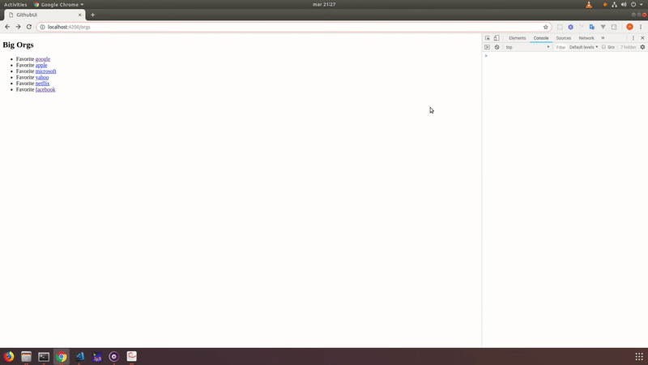

### Getting Started

This is a emberjs 3.5 course/seminar. You can take a look at each branch to see each section topic. 

For example in the first part we are connecting to github api from local ember app, to show 5 big companies and their repos, issues and contributors.  



This project was bootstrapped with Emberjs 3.5. It is not tested in production environment, it is just an example app. So, use it under your responsibility.

**Important!!!: You must change the token (to make calls to github api) for one of your own.**

## Build Setup

``` bash
# install ember command line interface
npm install -g ember-cli

# install dependencies
yarn install

# serve with hot reload at http://localhost:4200/orgs
ember s